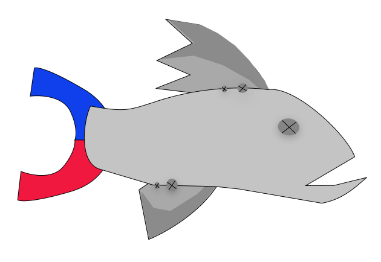
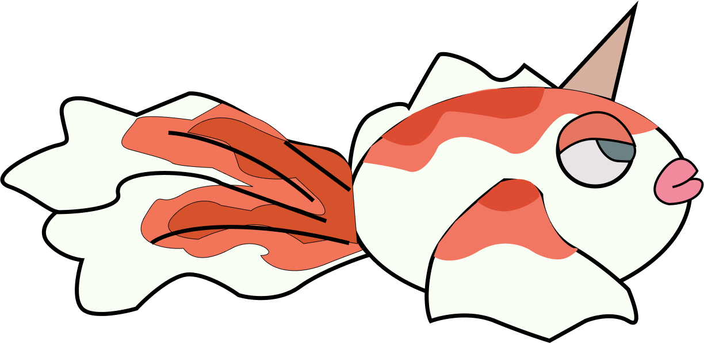
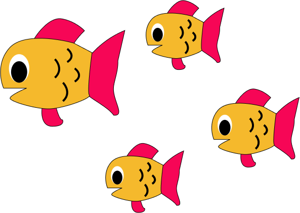
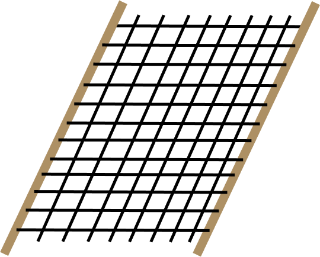
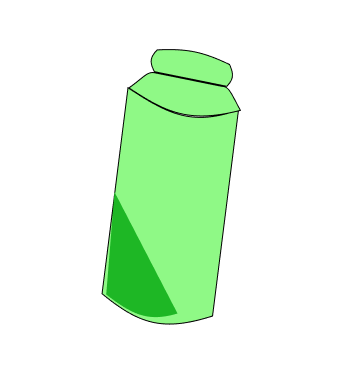
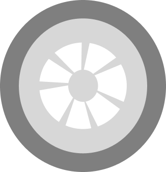
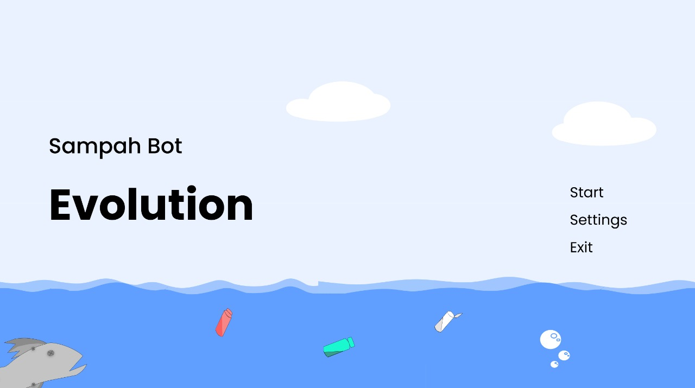
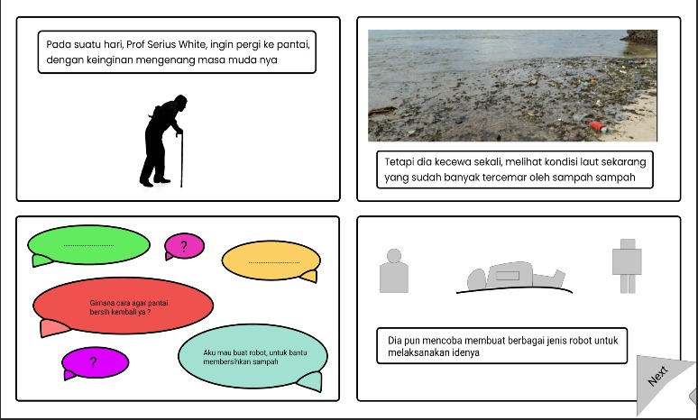
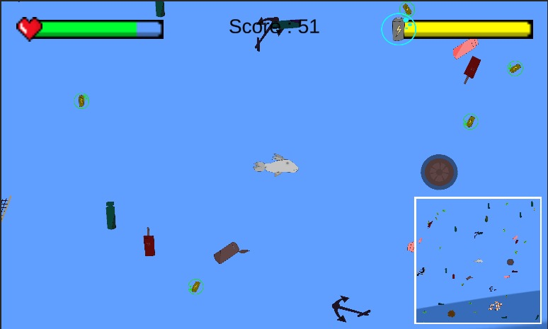
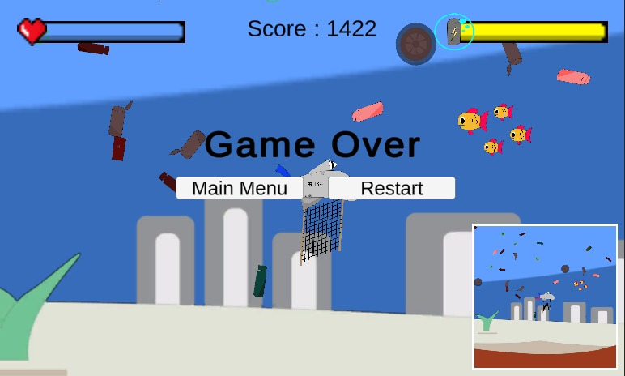

# Sampah Evolution

## Anggota dan Role:
<table>
    <thead>
        <tr>
            <th></th>
            <th>Nama</th>
            <th>NIM</th>
            <th>Role</th>
        </tr>
    </thead>
    <tbody>
        <tr>
            <td>1</td>
            <td>Antonius Anre Sianturi</td>
            <td>G64190053</td>
            <td>Game Developer</td>
        </tr>
        <tr>
            <td>2</td>
            <td>Muhammad Adjie Bimaditya</td>
            <td>G64190062</td>
            <td>Game Developer</td>
        </tr>
        <tr>
            <td>3</td>
            <td>Maxdha Maxiwinata</td>
            <td>G64190105</td>
            <td>Game Artist</td>
        </tr>
    </tbody>
</table>

# Story
Ada professor yang merasa miris  melihat keadaan laut  sekarang, sehingga dia berinovasi menciptakan suatu robot yang dapat membantu manusia dalam
memebersihkan laut. 

Tujuan dari robot ini adalah  mengambilkan sampah sampah yang berada di lautan, tapi ternyata tidak semudah itu, 

Beberapa kali mencoba, tapi semua percobaan nya gagal, sampai suatu saat, dia menciptakan suatu robot dengan inspirasi dari ikan sapu sapu ... 

# Rules
1. Terdapat robot yang mengumpulkan sampah di bawah laut
2. Robot ini memiliki fitur untuk ngambil berbagai jenis sampah
3. Fitur robot akan terus diupgrade berdasarkan evolusinya
4. Di setiap tahap evolusi terdapat syarat score, yaitu mendapatkan sampah dengan suatu kondisi (berdasarkan jenisnya atau beratnya)
5. Robot mengambil daya dari batre yang dapat dicas ketika robot berada di permukaan (menggunakan panel surya)
6. Game bersifat endless dengan tingkat kesulitan selalu bertambah
7. Game over ketika batre habis dan robot masih di dalam air

# Goal
Mengambil sampah berdasarkan karakteristik (jenis atau berat) dengan selalu memperhitungkan daya baterai agar dapat membawa sampah tersebut ke lokasi pengumpulan.

# Assets
<table>
  <tr>
      <td></td>
      <td></td>
      <td></td>
  </tr>
   <tr>
      <td></td>
      <td></td>
      <td></td>
  </tr>
  <tr>
      <td></td>
      <td></td>
      <td></td>
  </tr>
  <tr>
      <td></td>
      <td></td>
      <td></td>
  </tr>
  <tr>
     <td></td>
     <td></td>
     <td></td>
  </tr>
    <tr>
     <td></td>
     <td></td>
     <td></td>
  </tr>
   <tr>
     <td></td>
     <td></td>
  </tr>
   <!-- <tr>
     <td></td>
     <td></td>
     <td></td>
  </tr> -->
</table>

# Preview
<table>
  <tr>
      <td></td>
  </tr>
  <tr>
      <td></td>
  </tr>
  <tr>
      <td></td>
  </tr>
  <tr>
      <td></td>
  </tr>
</table>

# Documents
* [Assets](https://www.figma.com/file/rIjheHgHrAjRS1WXvhhCd6/GRAFKOM-P2_3)
* [Documentation](https://docs.google.com/document/d/1YrmrxCV3LJL_GhKjlUOB1V-8qCmVzsPPBZyIcKZcEvY/edit)
* [Demo Video](https://drive.google.com/drive/folders/1W7SKXXk6zpKeXPTcG7Wbc5sXt4hNQW8G)
